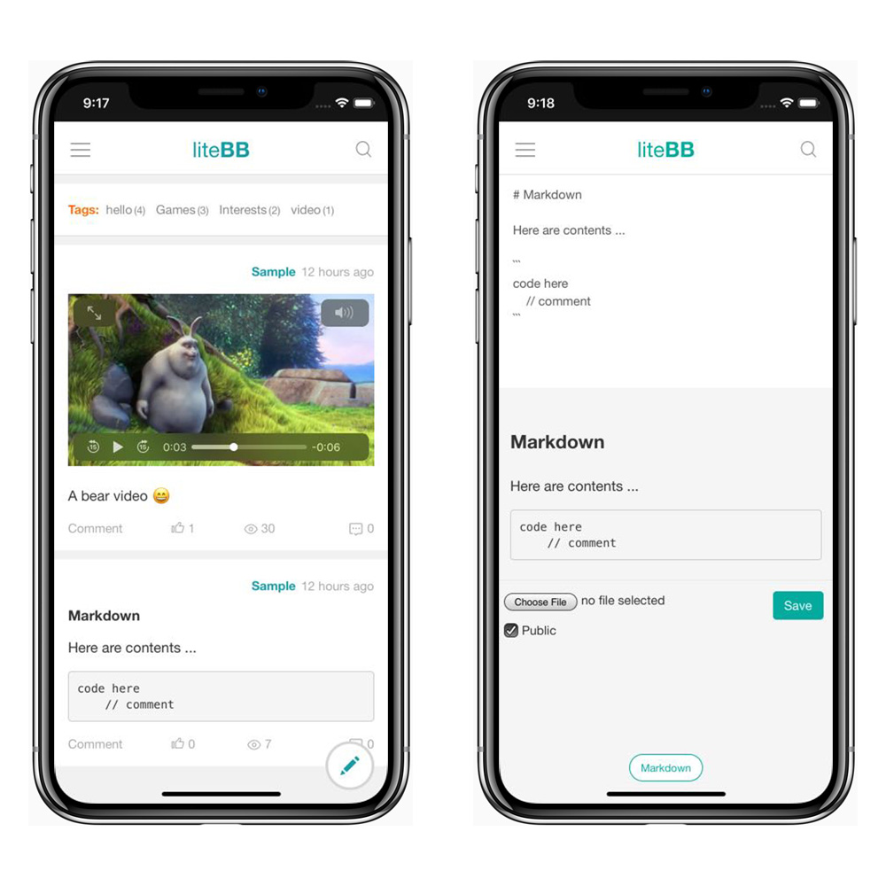

# liteBB

liteBB is a lite Blog & Board on mobile.

* Mobile first
* lite and Powerful
* Share text, image, video and file
* Markdown & real-time preview
* Comment / Reply to comment
* i18n Support
* PWA standalone App (Android and iOS12)

# Quickstart

Clone or download liteBB, only 2 steps to start with Python 3:

    pip install -r requirements.txt
    python manage.py runserver --host 0.0.0.0 --port=80

Visit http://127.0.0.1/ or server address, the default User/Password is `admin/admin`.

View sample: [try.litebb.com](https://try.litebb.com)

# Install in one minute

Try now on Ubuntu 14/16/18 or Debian 8/9:

    ubuntu@vm-ubuntu:~# sudo apt update
    ubuntu@vm-ubuntu:~# sudo apt install git
    ubuntu@vm-ubuntu:~# git clone https://github.com/litebb/litebb
    ubuntu@vm-ubuntu:~# cd litebb
    ubuntu@vm-ubuntu:~/litebb# sudo apt install python3-pip
    ubuntu@vm-ubuntu:~/litebb# sudo pip3 install -r requirements.txt
    ubuntu@vm-ubuntu:~/litebb# sudo /usr/local/bin/gunicorn -w 4 -b 0.0.0.0:80 wsgi:application

*Prerequisites: only Python 3 is required on Linux distributions.*

***

Suggestions for liteBB deployment:

1. Create a virtualenv
2. Install MySQL for liteBB (default is SQLite)
2. Run liteBB with Gunicorn, or Gunicorn and Nginx
4. Use Supervisor or Systemd to start Gunicorn on boot
5. Enforce HTTPS (PWA required)

# Screenshots

# License

liteBB is licensed under the [CC-BY-SA 4.0](http://creativecommons.org/licenses/by-sa/4.0/), the attribution requires the following foot-note:

    Powered by <a href="https://litebb.com">liteBB</a>

# Links

* [liteBB](https://litebb.com)
